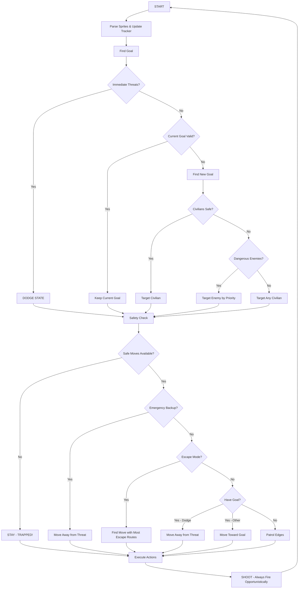

# Expert FSM v6 Logic Diagram

## Overview
This document distills the logic of `expert_fsm_v6.py` into a clear state diagram and rule set. The FSM implements a sophisticated goal-oriented finite state machine for playing Robotron 2084 with a "never get hit" philosophy.

## State Diagram



## Core Architecture

### Entity Tracking System
- **Position History**: Tracks last 5 positions of all entities
- **Velocity Calculation**: Computes movement vectors from position history
- **Future Prediction**: Predicts where entities will be N frames ahead
- **Collision Prediction**: Uses trajectory analysis instead of simple distance checks

### Goal-Oriented Planning
- **Commit to Targets**: Focus on goals (sprites to pursue) rather than actions (directions)
- **Plan Ahead**: Use intercept paths and lead shots instead of reactive chasing
- **State Persistence**: Maintain current goal until completion or invalidation

## Decision Logic

### 1. Goal Finding Priority (State Selection)

The FSM selects goals in strict priority order:

#### Priority 1: DODGE - Immediate Threats
- **Bullets**: Predicted to hit within 15 frames using trajectory analysis
- **Hulks**: Immortal enemies within 50px distance
- **Action**: Switch to dodge state for evasive maneuvers

#### Priority 2: KEEP - Current Goal Validation
- Check if current goal still exists and is trackable
- Match by position proximity (<50px) and sprite type
- Reset strafing behavior if goal changes or disappears

#### Priority 3: CIVILIAN - Family Members
- **Conditions**: 
  - No dangerous enemies within 150px, OR
  - Civilian is very close (<80px)
- **Benefit**: Provides extra lives
- **Action**: Direct movement toward civilian

#### Priority 4: ENEMY - Hostile Targets by Danger Level
- **Spawners** (Brain/Sphereoid/Quark): **+1000 priority** - Create overwhelming enemy swarms
- **Shooters** (Enforcer/Tank): **+500 priority** if <200px, **+200** otherwise - Bullet threats
- **Chasers** (Grunt/Prog): **+50 priority** - Basic enemies
- **Action**: Attack using strafing patterns

#### Priority 5: FALLBACK - Any Remaining Civilians
- Collect any remaining family members when no enemies present

### 2. Safety System (Never Get Hit Philosophy)

The core principle: **Perfect information game = Should never get hit**

#### Collision Prediction System
```
Type-Specific Collision Radii:
- Electrode: 35px (stationary obstacles)
- Hulk: 40px (25px when surrounded by 3+ Hulks)
- Grunt/Prog: 35px (increased from deaths at 30-39px range)
- Default: 20px (other enemy types)
- Bullets: 35px (trajectory-based prediction)
```

#### Safety Validation
- **Look-ahead**: Check 3 frames into the future for all moves
- **Trajectory Analysis**: Predict collision paths, not just distances
- **Multi-frame Interpolation**: Check collision at each frame along movement path
- **Aggressive Mode**: Relaxed Hulk collision (30px) when pursuing high-value targets

### 3. Movement Decision Hierarchy

#### Step 1: Safety Check
- Generate list of all moves that won't cause collision
- If no safe moves available → **STAY** (trapped state)

#### Step 2: Emergency Backup
- **Trigger**: Enemy within critical distance (<40px)
- **Action**: Move directly away from threat using safest available direction
- **Priority**: Overrides all other movement goals

#### Step 3: Escape Mode
**Triggers**:
- Less than 5 safe moves available, OR
- Bullet predicted to hit within 10 frames

**Action**: 
- Find move that maximizes future escape corridors
- Count safe directions from potential positions
- Choose move leading to most open space

#### Step 4: Goal Execution

##### DODGE State (Evasive Maneuvers)
- **Bullets**: Use perpendicular dodging (move perpendicular to trajectory)
- **Other Threats**: Distance-based evasion (move away)
- **Wall Avoidance**: Strong penalty (-200) for moves near walls when bullets present

##### ATTACK State (Enemy Engagement)
- **Strafing Pattern**: Move perpendicular to enemy while shooting
- **Commitment**: Hold strafe direction for 15 frames (prevents jittering)
- **Range Management**: 
  - Too far (>200px): Move closer
  - Too close (<70px): Back away
  - Optimal (70-200px): Strafe around enemy

##### COLLECT State (Civilian Rescue)
- **Direct Path**: Move straight toward civilian position
- **No Strafing**: Simple intercept calculation

#### Step 5: Patrol Mode
- **Trigger**: No active goal
- **Behavior**: Stay on board edges, avoid dangerous center
- **Scoring**: Maximize distance from center, minimize distance to nearest edge

### 4. Combat System (Always Shooting)

**Philosophy**: Always fire at something - constant offense

#### Target Priority Queue
1. **Incoming Bullets** (will hit <20 frames) - **Active Defense!**
2. **Other Bullets** within 300px
3. **Spawners** within 300px - Prevent enemy multiplication
4. **Shooters** within 300px - Eliminate ranged threats
5. **Regular Enemies** within 300px - Clear basic threats
6. **Obstacles** (Electrodes) within 300px - Points and path clearing
7. **Fallback**: Shoot toward nearest enemy (general direction)

#### Lead Shot Calculation
- Calculate bullet travel time to target
- Predict target's future position based on velocity
- Aim at intercept point, not current position
- Uses 8-directional firing constraints

#### Firing Line Detection
```
8-Way Firing Directions (30px threshold):
- RIGHT: |dy| < 30 && dx > 0
- UP_RIGHT: |dx - dy| < 30 && dx > 0 && dy < 0
- UP: |dx| < 30 && dy < 0
- UP_LEFT: |dx + dy| < 30 && dx < 0 && dy < 0
- LEFT: |dy| < 30 && dx < 0
- DOWN_LEFT: |dx - dy| < 30 && dx < 0 && dy > 0
- DOWN: |dx| < 30 && dy > 0
- DOWN_RIGHT: |dx + dy| < 30 && dx > 0 && dy > 0
```

### 5. Special Behaviors

#### Strafing System
- **Purpose**: "Spray" enemies while maintaining safe distance
- **Method**: Move perpendicular to enemy position
- **Commitment**: 15-frame commitment to prevent oscillation
- **Direction**: Random clockwise/counter-clockwise selection

#### Bullet Trajectory Prediction
```python
Key Innovation: Trajectory-based collision prediction
- Track bullet velocity vectors
- Predict collision along future path
- Use perpendicular dodging for bullets
- Distance-based fallback for stationary threats
```

#### Wall and Center Avoidance
- **Center Zone**: 200x200px danger area (high enemy density)
- **Wall Proximity**: <150px triggers avoidance when bullets present
- **Escape Planning**: Count safe corridors from each potential position

#### Aggressive Pursuit Mode
- **Trigger**: When targeting high-value enemies
- **Effect**: Relaxed Hulk collision detection (30px vs 40px)
- **Purpose**: Allow threading between Hulks to reach enemies

### 6. Key Constants and Parameters

#### Movement Parameters
```
Player Speed: 5 px/frame
Bullet Speed: 8 px/frame
Grunt Speed: 3 px/frame
Hulk Speed: 2 px/frame
```

#### Safety Thresholds
```
Look-ahead Frames: 3
Emergency Backup Distance: 40px
Escape Mode Trigger: <5 safe moves OR bullet hit <10 frames
Shooting Range: 300px
Critical Bullet Distance: 80px
Wall Avoidance Threshold: 150px (when bullets present)
```

#### Board Dimensions
```
Board Width: 665px
Board Height: 492px
Center Danger Zone: 200x200px
```

## Implementation Notes

### Entity Tracking
- Uses grid-based ID system (20px grid) for entity matching across frames
- Maintains 5-frame position history for velocity smoothing
- Handles entity spawn/despawn through position proximity matching

### Performance Optimizations
- Caches safe move calculations
- Limits trajectory prediction to 30 frames
- Uses squared distances where possible
- Batches collision checks by entity type

### Debug System
- Outputs detailed state information every 20 frames
- Tracks goal changes, safe moves, and decision reasoning
- Provides full enemy list with distances and velocities

## Philosophy Summary

The FSM operates on three core principles:

1. **Perfect Information**: Since the game state is fully observable, optimal play should never result in taking damage
2. **Goal-Oriented**: Commit to targets and plans rather than reactive moment-to-moment decisions
3. **Predictive**: Use entity tracking and trajectory prediction to plan ahead rather than react to current positions

This creates a robust, aggressive player that prioritizes survival while maintaining constant offensive pressure.